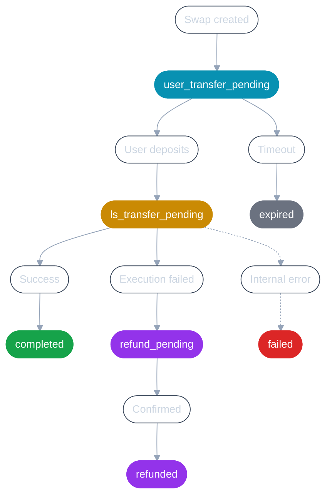

### User Transfer Pending
**Status:** `user_transfer_pending`

When a swap is created, it starts with `user_transfer_pending` status. Layerswap is waiting for the user to complete the transaction in the source network.

### Expired
**Status:** `expired`

If the user does not complete the transaction in the source network within 3 hours, the swap status will be changed to `expired`.

### Layerswap Transfer Pending
**Status:** `ls_transfer_pending`

After the user has completed the transaction in the source network, Layerswap will verify the transaction and match it with the corresponding swap. An Input transaction object will be created to describe the user's transaction. The swap status will be changed to `ls_transfer_pending`.

### Completed
**Status:** `completed`

Layerswap has successfully processed the swap and sent the funds to the destination address in the destination network.

### Failed
**Status:** `failed`

In rare cases, an unexpected internal error may prevent Layerswap from processing the swap or initiating a refund automatically. The Layerswap team will be notified and will resolve the issue as soon as possible.

### Refund Pending
**Status:** `refund_pending`

When a swap cannot be completed, Layerswap automatically initiates a refund. The swap status will be changed to `refund_pending` while the refund transaction is being processed on the **source chain** using the **source token**. See the [Refunds](/api-reference/refunds) page for details.

### Refunded
**Status:** `refunded`

The refund transaction has been confirmed on the source chain and the user's funds have been returned. The swap's `transactions` array will include a transaction with `type: "refund"`.
