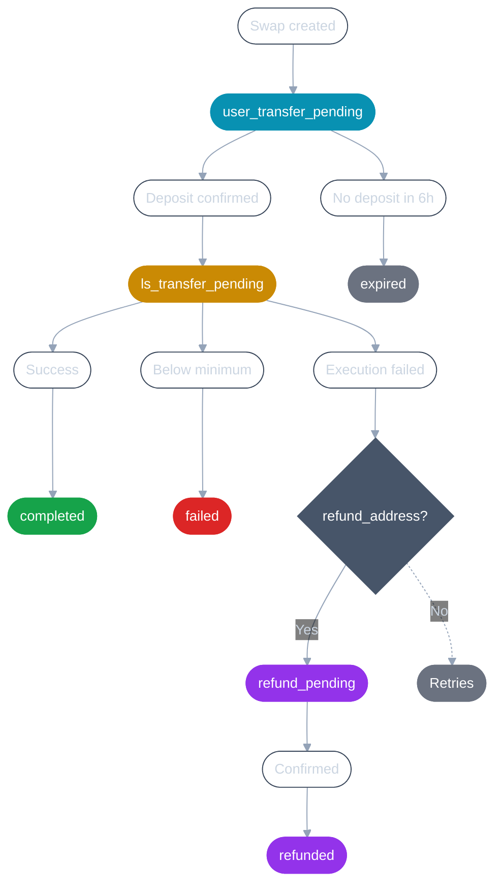

```mermaid
%%{init: {'theme': 'base', 'themeVariables': {'background': '#1a1a2e', 'lineColor': '#94a3b8', 'fontSize': '14px', 'edgeLabelBackground': 'transparent', 'tertiaryTextColor': '#ffffff'}}}%%
graph TD
    l1([Swap created]) --> B([user_transfer_pending])
    B --> l2([Deposit confirmed]) --> D([ls_transfer_pending])
    B --> l3([No deposit in 6h]) --> C([expired])
    D --> l4([Success]) --> E([completed])
    D --> l5([Below minimum]) --> F([failed])
    D --> l6([Execution failed]) --> R{refund_address?}
    R --> |Yes| G([refund_pending])
    R -.-> |No| M([Retries])
    G --> l7([Confirmed]) --> H([refunded])

    classDef label fill:none,color:#cbd5e1,stroke:#334155,stroke-width:1px

    class l1,l2,l3,l4,l5,l6,l7 label

    style R fill:#475569,color:#fff,stroke:#475569
    style M fill:#6b7280,color:#fff,stroke:#6b7280

    style B fill:#0891b2,color:#fff,stroke:#0891b2
    style D fill:#ca8a04,color:#fff,stroke:#ca8a04
    style E fill:#16a34a,color:#fff,stroke:#16a34a
    style C fill:#6b7280,color:#fff,stroke:#6b7280
    style F fill:#dc2626,color:#fff,stroke:#dc2626
    style G fill:#9333ea,color:#fff,stroke:#9333ea
    style H fill:#9333ea,color:#fff,stroke:#9333ea
```

## Flow

### 1. `user_transfer_pending`

Swap is created. Layerswap is waiting for the user to complete the transaction in the source network.

- If no deposit arrives within **6 hours** → `expired`
- Once the deposit is confirmed with enough confirmations → `ls_transfer_pending`

### 2. `ls_transfer_pending`

Layerswap is processing the swap. If something goes wrong during execution:

- If deposited amount is **below the minimum** → `failed`
- If the swap cannot be completed for any other reason (e.g. price moved beyond slippage tolerance) → Layerswap **retries automatically**.
  - **With `refund_address`** → if retries are exhausted, moves to `refund_pending`
  - **Without `refund_address`** → Layerswap keeps retrying. The swap remains in `ls_transfer_pending` until resolved.
- If execution succeeds → `completed`

### 3. `completed`

Funds are delivered to the destination address.

### 4. `refund_pending` → `refunded`

Refund is sent to `refund_address` on the source chain in the source token, **minus gas fees**. If the refund amount is less than the gas fee, no refund is issued. See the [Refunds](/api-reference/refunds) page for details.

## What can go wrong

| Scenario | With refund_address | Without refund_address |
|---|---|---|
| Deposited less than minimum | failed | failed |
| Liquidity exhausted | Retries, then refunded | Retries |
| Blockchain or DEX issue | Retries, then refunded | Retries |
| Price moved beyond slippage tolerance | Retries, then refunded | Retries |
