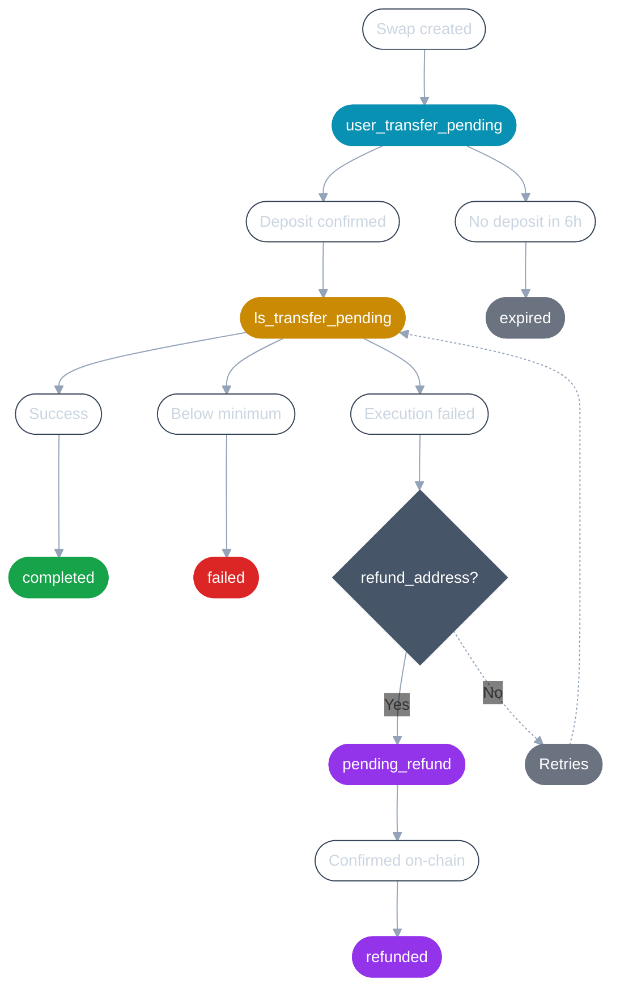

A swap progresses through a fixed set of statuses.

{/* TODO(API, Q2.3): Confirm whether the widget's `created` state is API-visible; this page documents the seven statuses in the API contract. */}

## Flow

### 1. `user_transfer_pending`

Swap is created. Layerswap is waiting for the user to complete the transaction in the source network.

- If no deposit arrives within **6 hours** → `expired`
- Once the deposit is confirmed with enough confirmations → `ls_transfer_pending`

### 2. `ls_transfer_pending`

Layerswap is processing the swap. If something goes wrong during execution:

- If deposited amount is **below the minimum** → `failed`
- If the swap cannot be completed for any other reason (e.g. price moved beyond slippage tolerance) → Layerswap **retries automatically**.
  - **With `refund_address`** → if retries are exhausted, moves to `pending_refund`
  - **Without `refund_address`** → Layerswap keeps retrying. The swap remains in `ls_transfer_pending` until resolved.
- If execution succeeds → `completed`

### 3. `completed`

Funds are delivered to the destination address.

### 4. `pending_refund` → `refunded`

Refund is sent to `refund_address` on the source chain in the source token, **minus gas fees**. If the refund amount is less than the gas fee, no refund is issued. See [Refunds](/concepts/refunds) for details.

## What can go wrong

| Scenario | With refund_address | Without refund_address |
|---|---|---|
| Deposited less than minimum | failed | failed |
| No liquidity or route available across providers | Retries, then refunded | Retries |
| Slippage tolerance cannot be met | Retries, then refunded | Retries |
| Blockchain issue across multiple RPCs | Retries, then refunded | Retries |
| DEX or DEX aggregator issue | Retries, then refunded | Retries |

## Transaction-level detail

A swap can include multiple transactions, such as the deposit, payout, refuel, or refund. Each transaction has its own `type` and `status`. Use the transaction status to track that specific on-chain operation, use the swap-level `status` to track the overall swap lifecycle.

## Filtering swaps by status

Status names used in API responses are different from those accepted by the `GET /swaps` filter. For example, a swap response uses `pending_refund`, while the corresponding filter value is `PendingRefund`.

See [Track swaps](/api/track-swaps) for the complete list of filter values.

{/* TODO(API): Validate that GET /swaps status filters use different values from swap response statuses. If confirmed, update the backend so filters accept the same status values returned in responses, then update this section and the Track swaps mapping table. */}

## Observing status changes

- **API**: poll [`GET /swaps/{id}`](/api-reference/swaps/get-swap-details), or look up by funding transaction with [`GET /swaps/by_transaction_hash/{hash}`](/api-reference/swaps/get-swap-by-transaction-hash).
- **Webhooks**: receive dashboard-configured status updates — [Webhooks](/api/webhooks).
- **Widget**: use [`onSwapStatusChange`](/widget/events/on-swap-status-change) to receive `{type, swapId, path?}`.

{/* TODO(API): Confirm and document the recommended polling interval and rate limits for GET /swaps/{id}. */}

## Next

[Build your first API swap](/api/quickstart) applies this lifecycle end to end. [Refunds](/concepts/refunds) explains refund handling, addresses, fees, and transaction data. [Track swaps](/api/track-swaps) covers polling, filters, and transaction-hash lookup.
