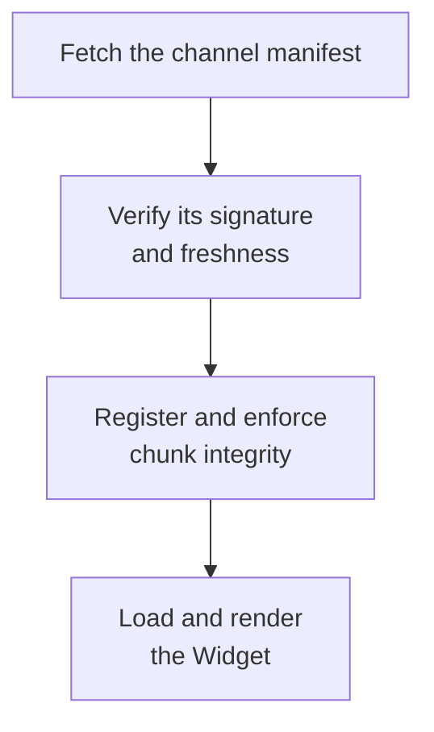

`@layerswap/widget-react` and `@layerswap/widget-js` are small loaders. They fetch the Widget at runtime from a signed Layerswap CDN channel instead of adding its implementation and wallet SDKs to your application bundle.

## Loading and verification



On mount, the loader:

1. Fetches the channel's `manifest.json` from the fixed URL baked into the package. Props, environment variables, and page globals cannot change this origin.
2. Verifies a detached ECDSA P-256 signature against the public key baked into the npm package. The signed manifest has a 30-day validity window and the loader allows five minutes of clock skew.
3. Registers the manifest's SHA-384 integrity values. Remote chunks that are missing from the signed map or fail their integrity check are blocked.
4. Loads the remote through Module Federation and renders it. React hosts share only `react` and `react-dom` as singletons; the JavaScript loader's remote supplies its own React runtime.

Successful loads write a provenance line to the console in this form:

```text
[layerswap/widget-js] widget <version> (<sha>, built <timestamp>)
```

The loader can reuse a successful resolution for up to 60 seconds. Failed resolutions are not cached, so remounting can recover from a transient failure.

Layerswap can temporarily disable new Widget loads for a release channel. Existing Widget sessions continue running, and a recently resolved Widget may remain mountable for up to 60 seconds because of loader reuse.

## Trust model

Trust is rooted in the signing public key inside the npm package, not in the CDN. The CDN hosts bytes but cannot create a manifest that passes signature verification. Rotating the signing key requires publishing a new loader package.

## Recommended Content Security Policy

Allow the production Widget origin in both `script-src` and `connect-src`:

```text
Content-Security-Policy:
  default-src 'self';
  script-src   'self' https://cdn.layerswap.io;
  connect-src  'self' https://cdn.layerswap.io
               https://api.layerswap.io https://layerswap.io
               https://*.walletconnect.com https://*.walletconnect.org;
  style-src    'self' 'unsafe-inline';
  img-src      'self' data: https:;
  font-src     'self' data:;
  frame-src    'self';
```

- `https://cdn.layerswap.io` is needed for the manifest fetch, remote entry, and chunks.
- `https://layerswap.io` covers feature-flag and supported relay requests.
- Runtime style injection requires `'unsafe-inline'` in `style-src`.
- WalletConnect v2 needs its relay origins.
- Add the RPC origins used by any host-provided wagmi transports and enabled networks.

## Two error channels

| Channel | Prop | Fires for | Payload |
|---|---|---|---|
| Loader | top-level `onError` | Manifest, network, remote-load, or render failures | `ManifestError` for manifest failures, otherwise the thrown error |
| Widget | `callbacks.onError` | API, wallet, transaction, and other runtime failures inside a loaded Widget | `ErrorEventType`; see [`onError`](/widget/events/on-error) |

## Manifest failure modes

`ManifestError.reason` has exactly five values:

| Reason | Cause and next check |
|---|---|
| `fetch` | The manifest is unreachable, blocked by CSP/CORS, or returned a non-success status. Check the network panel and `connect-src`. |
| `parse` | The response is not a valid manifest. |
| `signature` | The signature is missing, WebCrypto is unavailable, or verification fails. |
| `kill-switch` | Layerswap temporarily disabled new Widget loads for this channel. No change is required in the host application. |
| `stale` | `expiresAt` is missing or the signed validity window has passed, including the five-minute skew allowance. |

Manifest freshness is checked only for new mounts. A page that has already loaded the code continues running. Re-signing and republishing the channel restores new mounts.
